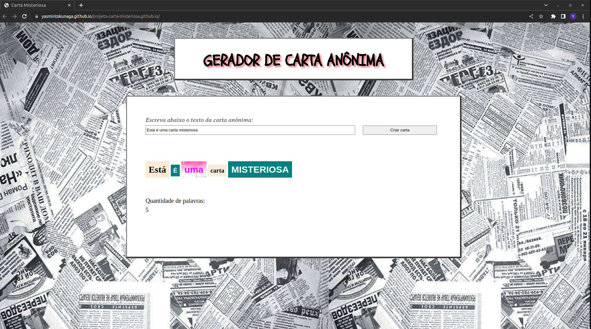

# Projeto Carta Misteriosa

Projeto realizado durante o curso de Desenvolvimento Web na Trybe em Dezembro, 2022.

# Conhecimentos técnicos utilizados: 

* HTML, 
* CSS, 
* JavaScript (DOM, seletores, eventos).

# Objetivo: 

A partir de um texto digitado pelo usuário, gerar uma carta misteriosa, ou seja, utilizar estilos diferentes para cada palavra inserida.

# Resquisitos: 

* Incluir um input de texto
* Incluir um botão para gerar a carta
* Incluir no CSS diferentes estilos: imagem de fundo, fonte, tamanho e cor.
* Inserir no container o texto digitado pelo usuário e aplicar de forma aleatória os estilos para cada palavra.
* Após gerar a carta, o usuário poderá mudar o estilo de uma palavra ao clicar em cima dela
* Incluir um contador de papavras.

# Resultado: 

